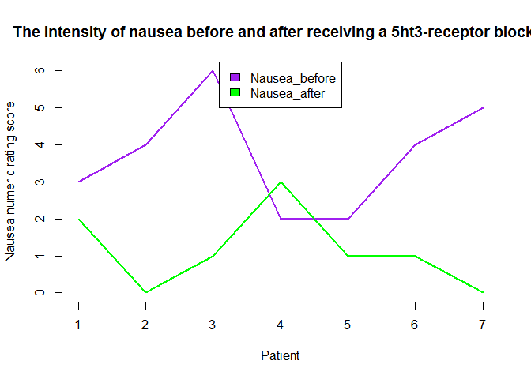

Hello Octocat
-------------

I love Octocat. she's the coolest cat in town 

Assignment 2
------------

    data("anscombe")
    dim.data.frame(anscombe)

    ## [1] 11  8

    colnames(anscombe)

    ## [1] "x1" "x2" "x3" "x4" "y1" "y2" "y3" "y4"

    head(anscombe)

    ##   x1 x2 x3 x4   y1   y2    y3   y4
    ## 1 10 10 10  8 8.04 9.14  7.46 6.58
    ## 2  8  8  8  8 6.95 8.14  6.77 5.76
    ## 3 13 13 13  8 7.58 8.74 12.74 7.71
    ## 4  9  9  9  8 8.81 8.77  7.11 8.84
    ## 5 11 11 11  8 8.33 9.26  7.81 8.47
    ## 6 14 14 14  8 9.96 8.10  8.84 7.04

    tail(anscombe)

    ##    x1 x2 x3 x4    y1   y2   y3    y4
    ## 6  14 14 14  8  9.96 8.10 8.84  7.04
    ## 7   6  6  6  8  7.24 6.13 6.08  5.25
    ## 8   4  4  4 19  4.26 3.10 5.39 12.50
    ## 9  12 12 12  8 10.84 9.13 8.15  5.56
    ## 10  7  7  7  8  4.82 7.26 6.42  7.91
    ## 11  5  5  5  8  5.68 4.74 5.73  6.89

    summary(anscombe)

    ##        x1             x2             x3             x4    
    ##  Min.   : 4.0   Min.   : 4.0   Min.   : 4.0   Min.   : 8  
    ##  1st Qu.: 6.5   1st Qu.: 6.5   1st Qu.: 6.5   1st Qu.: 8  
    ##  Median : 9.0   Median : 9.0   Median : 9.0   Median : 8  
    ##  Mean   : 9.0   Mean   : 9.0   Mean   : 9.0   Mean   : 9  
    ##  3rd Qu.:11.5   3rd Qu.:11.5   3rd Qu.:11.5   3rd Qu.: 8  
    ##  Max.   :14.0   Max.   :14.0   Max.   :14.0   Max.   :19  
    ##        y1               y2              y3              y4        
    ##  Min.   : 4.260   Min.   :3.100   Min.   : 5.39   Min.   : 5.250  
    ##  1st Qu.: 6.315   1st Qu.:6.695   1st Qu.: 6.25   1st Qu.: 6.170  
    ##  Median : 7.580   Median :8.140   Median : 7.11   Median : 7.040  
    ##  Mean   : 7.501   Mean   :7.501   Mean   : 7.50   Mean   : 7.501  
    ##  3rd Qu.: 8.570   3rd Qu.:8.950   3rd Qu.: 7.98   3rd Qu.: 8.190  
    ##  Max.   :10.840   Max.   :9.260   Max.   :12.74   Max.   :12.500

Assignment 3
------------

Assignment 4
------------

    library(readr)
    df <- read_csv("analgesic.csv")

    ## Parsed with column specification:
    ## cols(
    ##   ID = col_integer(),
    ##   Group = col_character(),
    ##   Measurement_1 = col_integer(),
    ##   Measurement_2 = col_integer(),
    ##   Measurement_3 = col_integer()
    ## )

    dim.data.frame(df)

    ## [1] 40  5

    colnames(df)

    ## [1] "ID"            "Group"         "Measurement_1" "Measurement_2"
    ## [5] "Measurement_3"

    head(df)

    ## # A tibble: 6 × 5
    ##      ID     Group Measurement_1 Measurement_2 Measurement_3
    ##   <int>     <chr>         <int>         <int>         <int>
    ## 1     1 Analgesic            26            26            21
    ## 2     2 Analgesic            29            26            23
    ## 3     3 Analgesic            24            28            22
    ## 4     4 Analgesic            25            22            24
    ## 5     5 Analgesic            24            28            23
    ## 6     6 Analgesic            22            23            26

    tail(df)

    ## # A tibble: 6 × 5
    ##      ID   Group Measurement_1 Measurement_2 Measurement_3
    ##   <int>   <chr>         <int>         <int>         <int>
    ## 1    35 Placebo            17            21            15
    ## 2    36 Placebo            19            17            15
    ## 3    37 Placebo            14            19            13
    ## 4    38 Placebo            17            19            13
    ## 5    39 Placebo            11            20            18
    ## 6    40 Placebo            15            18            12

    summary(df)

    ##        ID           Group           Measurement_1   Measurement_2 
    ##  Min.   : 1.00   Length:40          Min.   :10.00   Min.   : 8.0  
    ##  1st Qu.:10.75   Class :character   1st Qu.:17.00   1st Qu.:17.0  
    ##  Median :20.50   Mode  :character   Median :20.00   Median :20.0  
    ##  Mean   :20.50                      Mean   :20.12   Mean   :20.7  
    ##  3rd Qu.:30.25                      3rd Qu.:24.00   3rd Qu.:25.0  
    ##  Max.   :40.00                      Max.   :30.00   Max.   :32.0  
    ##  Measurement_3  
    ##  Min.   :12.00  
    ##  1st Qu.:16.00  
    ##  Median :20.50  
    ##  Mean   :20.52  
    ##  3rd Qu.:24.25  
    ##  Max.   :30.00

    library(tidyr)
    library(dplyr)

    ## 
    ## Attaching package: 'dplyr'

    ## The following objects are masked from 'package:stats':
    ## 
    ##     filter, lag

    ## The following objects are masked from 'package:base':
    ## 
    ##     intersect, setdiff, setequal, union

    library(forcats)

    altered_df <- df %>%
      # Tidy up df data from wide to long format
      gather(key = Measurements, 
             value = results, 
             Measurement_1:Measurement_3) %>%
      # Set group factor
      group_by(Measurements) %>%
      # Summarise the data by calculating the mean across the measurements on each individual
      summarise (mean = mean(results)) %>%
      # Ungroup
      ungroup()
      #Print out the final data frame
      altered_df

    ## # A tibble: 3 × 2
    ##    Measurements   mean
    ##           <chr>  <dbl>
    ## 1 Measurement_1 20.125
    ## 2 Measurement_2 20.700
    ## 3 Measurement_3 20.525

Assignment 5
------------

chunk 1
=======

    ## Null Hypotheses
    # H0: The weights of the chicks is not dependent on the feed

    ## Alternative hypotheses
    #H1: The weights of the chicks depends on the feed

    #read data
    chicken <- read_csv("chick-weights.csv")

    ## Parsed with column specification:
    ## cols(
    ##   weight = col_integer(),
    ##   feed = col_character()
    ## )

    # plot boxplot
    boxplot(weight~feed, data= chicken)

    # Statistical tests 
    chickstat <-aov(weight~feed, data = chicken)
    summary(chickstat)

    ##             Df Sum Sq Mean Sq F value   Pr(>F)    
    ## feed         5 231129   46226   15.37 5.94e-10 ***
    ## Residuals   65 195556    3009                     
    ## ---
    ## Signif. codes:  0 '***' 0.001 '**' 0.01 '*' 0.05 '.' 0.1 ' ' 1

    ## Test statistic and underlying assumptions
    #compares samples of 3 or more groups

    # Degrees of freedom
    DF= 5

    ## P-Value
    #P<0.05

    ## Interpretation of outcome
    #Reject null hypotheses therefore the weights of the chicks is dependent on the feed

chunk 2
=======

    ## Null Hypotheses
    #H0: The contaminated water does not cause gastroenteritis

    ## Alternative hypotheses
    #H1: The contaminated water causes gastroenteritis 

    #read data
    gastroenteritis <- read_csv("gastroenteritis (1).csv")

    ## Parsed with column specification:
    ## cols(
    ##   Consumption = col_character(),
    ##   Outcome = col_character()
    ## )

    # Tidy data using scatterplot
    y <- xtabs(~Consumption + Outcome, data= gastroenteritis)
    y

    ##                     Outcome
    ## Consumption          ill not ill
    ##   < 1 glasses/day     39     121
    ##   > 4 glasses/day    265     146
    ##   1 to 4 glasses/day 265     258

    # plotting the barplot
    barplot(y, beside = TRUE, ylab = 'Consumption', xlab = 'Outcome', main = 'gastroenteritis', col= c ('blue', 'purple', 'yellow')) 
    legend('top', c('<1 glasses/day', '>4 glasses/day', '1 to 4 glasses/day'), fill = c('blue', 'purple', 'yellow'))

    # Statistical tests 
    Z <- chisq.test(y, correct = TRUE)
    Z

    ## 
    ##  Pearson's Chi-squared test
    ## 
    ## data:  y
    ## X-squared = 74.925, df = 2, p-value < 2.2e-16

    ## Test statistic and underlying assumptions
    #analyses two categorical variables
    #determines an association between two variables

    # Degrees of freedom
    DF= 2

    ## P-Value
    #p<0.05

    ## Interpretation of outcome
    #Reject NULL hypothese therefore the contaminated water causes gastroenteritis

chunk 3
=======

    ## Null Hypotheses
    #H0: Receiving a 5HT3-receptor blocker does not reduce nausea

    ## Alternative hypotheses
    #H1: Receiving a 5HT3-receptor blocker does reduce nausea

    #read data
    nausea <- read_csv("nausea (1).csv")

    ## Parsed with column specification:
    ## cols(
    ##   Patient = col_integer(),
    ##   Nausea_before = col_integer(),
    ##   Nausea_after = col_integer()
    ## )

    ## Tidy data
    #The numeric rating scale is anchored at 0 (no nausea) to 6 (severe nausea) therefore remove row 9 (patient 8)

    # Plot line graph

    plot(nausea$Nausea_before~nausea$Patient, type = "l", ylim = c(0,6), xlab = "Patient", ylab = "Nausea numeric rating score", main = "The intensity of nausea before and after receiving a 5ht3-receptor blocker", col= "purple", lwd= 2)
    lines(nausea$Nausea_after~nausea$Patient, col= "green", lwd= 2)
    legend ("top", c("Nausea_before", "Nausea_after"),fill = c("purple", "green"))

    # Statistical test
    wilcox.test(nausea$Nausea_before,nausea$Nausea_after, paired = TRUE)

    ## Warning in wilcox.test.default(nausea$Nausea_before, nausea$Nausea_after, :
    ## cannot compute exact p-value with ties

    ## 
    ##  Wilcoxon signed rank test with continuity correction
    ## 
    ## data:  nausea$Nausea_before and nausea$Nausea_after
    ## V = 26, p-value = 0.04983
    ## alternative hypothesis: true location shift is not equal to 0

    ## Test statistic and underlying assumptions
    #The analyses two variables which are paired and non-parametric within one population group in order to determine the association between them

    ## p-value
    #p<0.05

    ## Interpretation of outcome
    #Reject null hypotheses therefore receiving a 5HT3-receptor blocker reduces nausea

Assignment 6
------------

chunk 1
=======

    ## Null Hypotheses
    #H0: The Housing Prices does not depend on the interest rates

    ## Alternative Hypotheses
    #H1: The Housing Prices depend on the interest rates

    #read data
    library(readr)
    housing <- read_csv("housing-prices.csv")

    ## Parsed with column specification:
    ## cols(
    ##   interest_rate = col_integer(),
    ##   median_house_price_USD = col_integer()
    ## )

    # Tidy data 
    interest= housing$interest_rate
    house_price= housing$median_house_price_USD
    head(cbind(interest, house_price))

    ##      interest house_price
    ## [1,]       10      183800
    ## [2,]       10      183200
    ## [3,]       10      174900
    ## [4,]        9      173500
    ## [5,]        8      172900
    ## [6,]        7      173200

    #plot scatterplot
    plot(interest, house_price, xlab = "interest", ylab = "house_price")
    abline(lm(housing$median_house_price_USD~housing$interest_rate, data=housing), col= "pink", lwd=2)

    ## Statistic test
    # Linear Regression
    housing1 <- lm(housing$median_house_price_USD~housing$interest_rate, data=housing)
    summary(housing1)

    ## 
    ## Call:
    ## lm(formula = housing$median_house_price_USD ~ housing$interest_rate, 
    ##     data = housing)
    ## 
    ## Residuals:
    ##    Min     1Q Median     3Q    Max 
    ## -55865 -31631 -16406  27212  80735 
    ## 
    ## Coefficients:
    ##                       Estimate Std. Error t value Pr(>|t|)    
    ## (Intercept)             399229      74427   5.364 9.99e-05 ***
    ## housing$interest_rate   -24309       9205  -2.641   0.0194 *  
    ## ---
    ## Signif. codes:  0 '***' 0.001 '**' 0.01 '*' 0.05 '.' 0.1 ' ' 1
    ## 
    ## Residual standard error: 43180 on 14 degrees of freedom
    ## Multiple R-squared:  0.3325, Adjusted R-squared:  0.2848 
    ## F-statistic: 6.974 on 1 and 14 DF,  p-value: 0.01937

    ## Plotting diagnostic plots

    # Diagnostic 1: Homoskedasticity
    plot(x=housing1$fitted.values, housing1$residuals, main = "Homoskedasticity", col= "orange")
    abline(h=0, col= "purple", lwd= 2)

    # Diagnostic 2: QQ plot
    qqnorm(housing1$residuals)
    qqline(housing1$residuals)

    # Binary outcome variable
    glm(housing$median_house_price_USD~housing$interest_rate, data=housing)

    ## 
    ## Call:  glm(formula = housing$median_house_price_USD ~ housing$interest_rate, 
    ##     data = housing)
    ## 
    ## Coefficients:
    ##           (Intercept)  housing$interest_rate  
    ##                399229                 -24309  
    ## 
    ## Degrees of Freedom: 15 Total (i.e. Null);  14 Residual
    ## Null Deviance:       3.91e+10 
    ## Residual Deviance: 2.61e+10  AIC: 390.8

    ## Test statistic and underlying assumptions
    #Scatter plot was done to determine the relationship between the two variables and the outliers 
    #Linear regression diagnostics were used to determine whether there was a linear trend. #Additionally, diagnostics were also used to determine whether the residuals were normally distributed and if the residuals have the same variance for all the fitted values of y.

    # Degrees of freedom
    15

    ## [1] 15

    # P-value
     p= 0.02
     p<0.05

    ## [1] TRUE

    ## Interpretation of outcome
    #The null hypotheses is thus rejected therefore the house prices depend on the interest rates.
